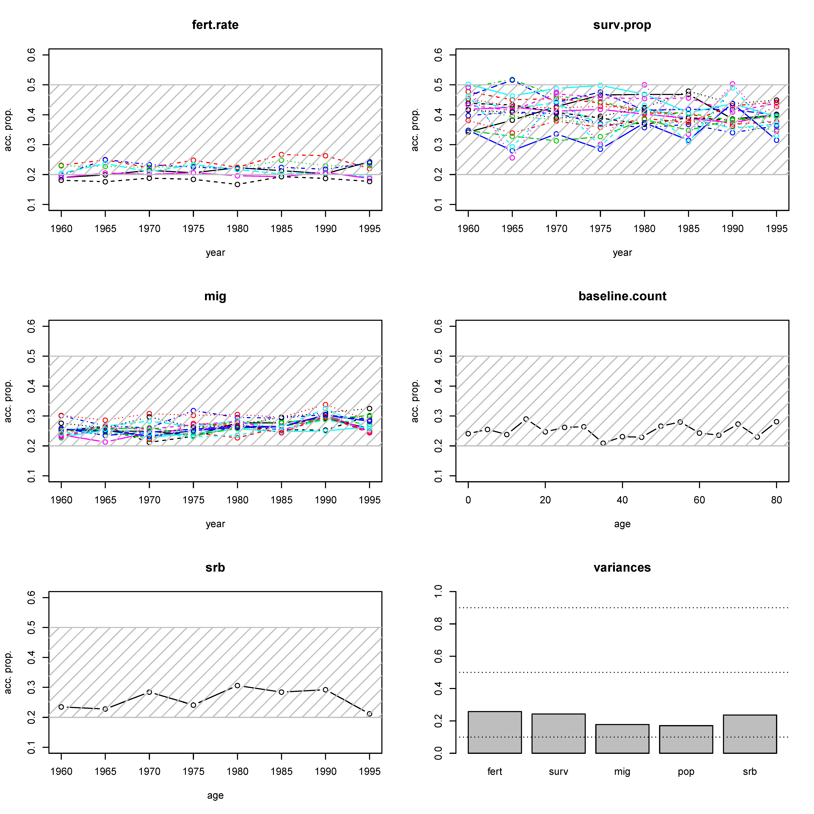
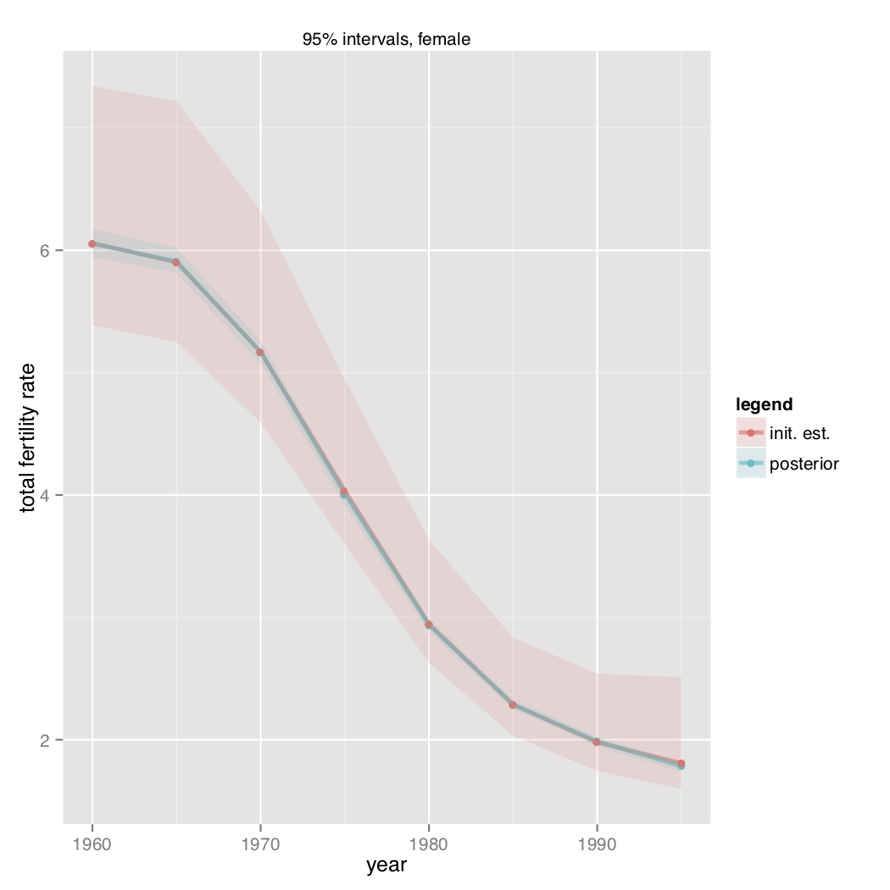
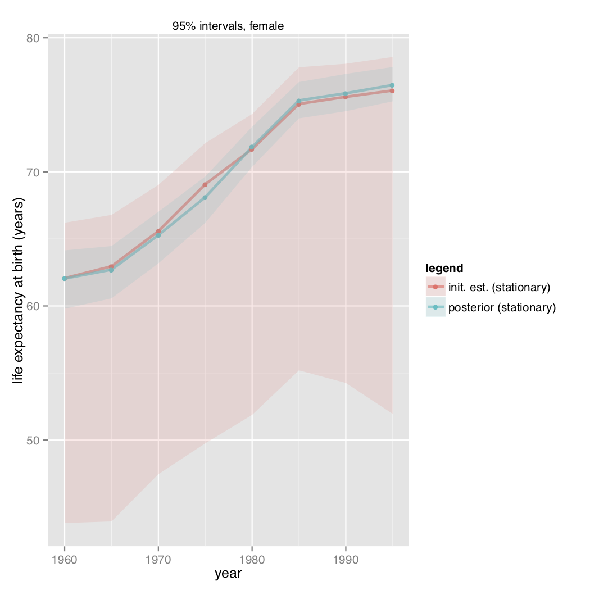
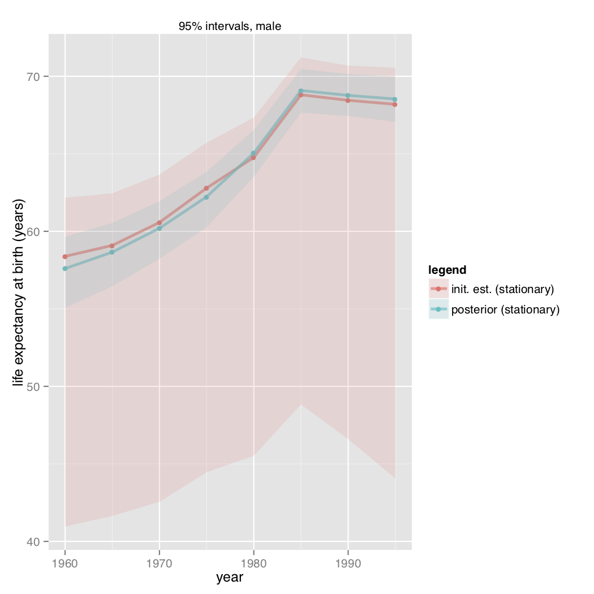

 
<!--FOR HTML OUTPUT
output: 
  bookdown::html_document2:
     base_format: theme: readable
     toc: yes
     toc_depth: 2

FOR FANCIER FORMATTING of HTML OUTPUT
  replace 'base_format' line with 'theme: readable'
-->


<!--FOR PDF OUTPUT
output:
  bookdown::pdf_document2:
     toc: yes
     toc_depth: 2
     includes:
       in_header: preamble.tex

NOTE: You might need to compile it twice
-->

```{r setup, echo = FALSE, results = "hide"}

library(knitr)
 ## set global chunk options
opts_chunk[["set"]](fig.path=".", fig.align="center", fig.show="hold", tidy=FALSE, strip.white=TRUE, warning = TRUE, message = TRUE, knitr.graphics.auto_pdf = TRUE)
options(formatR.arrow=TRUE,width=80)

 ###
 ### Functions
mae.t <- function(a, b)
{
   return( sqrt(2/pi) * sqrt(b) * gamma(a - 0.5) / gamma(a) )
}
mae.t.to.beta <- function(mae, a)
{
    return( (mae * gamma(a) / gamma(a - 0.5))^2 * pi / 2 )
}

 ###
 ### Formatting Sexpressions
pn <- function(x, digits = 1, ...) {
    a <- prettyNum(x, digits = digits, big.mark = ",", scientific = FALSE, ...)
    gsub("-", "\\$-\\$", a)
}
```

**Affiliations:** MCW: UN Population Division, wheldon@un.org. 

**Acknowledgements:** This is joint work with Adrian E. Raftery (Univ. of Washignton), Samuel
J. Clark (Ohio State Univ.), and Patrick Gerland (UN Population Division).

**Disclaimer:** The views and opinions expressed in this work are those of the authors and do not necessarily represent those of the United Nations. This work has not been formally edited and cleared by the United Nations.


# Background

Bayesian population reconstruction was introduced in the following series of
articles: @wheldon_reconstructing_2013, @wheldon_bayesian_2016,
@wheldon_bayesian_2015. There is an associated *R* package @wheldon_popreconstruct_2014 on *CRAN*
but a more up-to-date version is @wheldon_bayesian-reconstruction:_2017. 

In this vignette I will use wrapper functions that make things much
easier. These are available from
(https://github.com/markalava/Bayesian-Reconstruction/popReconstructWrappers). They
are based on two-sex reconstruction and the example of Thailand from
[@wheldon_bayesian_2015].


# Set-Up {#sec:Set-Up} 

```{r getting-files, echo = TRUE, message = FALSE, warning = FALSE}
## Install the package
library("devtools")

## Not run
## devtools::install_github(repo = "markalava/Bayesian-Reconstruction/workshops/ALAP_2018/popReconstructWrappers/package")

library(popReconstructWrappers)

## Create a directory for results
dir.create("poprecon")
setwd("poprecon")
```

# Inputs 

The inputs for the example are bundled with the package. Use `data()` to access them.

```{r init-ests-1, message = FALSE, echo = FALSE, results = "hide"}
oldls <- c(ls(), "oldls")
```

```{r init-ests-2, message = FALSE, warning = FALSE, results = "hide"}
data("Thailand_Example")
```

```{r init-ests-3, echo = FALSE}
setdiff(ls(), oldls)
```

The main inputs are initial estimates of 

  - fertility 
  - migration 
  - survival
  - population counts in the baseline year
  - population counts in subsequent years
  - sex ratios at birth
  
by sex, age, and year, and life table 'separation factors' to separate cohort deaths into period deaths. 

Proposal variances are additional inputs that control the efficiency of the MCMC algorithm. 

## Fertility Rates and SRBs

Fertility rates and SRBs are matrices with five-year periods as columns,
age-groups as rows.

```{r as-fert-mat}
asFertTHAI.mat[1:12, 1:5]
```

## Survival and Migration Proportions, Population Counts 

The remaining inputs are lists of two components, "female" and "male". Each component is a matrix with five-year periods as columns, age-groups as rows.

```{r as-surv-mat}
lapply(asSurvTHAI.mat, "[", i = 1:3, j = 1:5)
```

# Running the Reconstruction 

1. Set the seed:

```{r running-1}
set.seed(1)
```

2. Set the number of iterations. This will typically be in the 100,000s but here
  we do a quick run for a demonstration:

```{r running-2}
n.iter <- 17
burn.in <- 3
```

3. Convert elicited relative errors to hyperparamaters:

```{r running-3}
invGam.params <- make.hyper.params(absDev = list(fert = 0.1, surv = 0.1, mig = 0.2
             ,pop = 0.1, srb = 0.1)
             ,prob = list(fert = 0.9, surv = 0.9, mig = 0.9, pop = 0.9, srb = 0.9)
             ,alpha = list(fert = 0.5, surv = 0.5, mig = 0.5, pop = 0.5, srb = 0.5)
             ,s.star = unlist(asSurvTHAI.mat)
             )

invGam.params[1:2] 
```

4. Set the function arguments

```{r running-5}
estModArgs <- 
    list(## Algorithm parameters
        n.iter = n.iter, burn.in = burn.in

        ## Inputs:
        
        ## Inverse gamma parameters
       ,al.f = invGam.params$al.f
       ,be.f = invGam.params$be.f
       ,al.s = invGam.params$al.s
       ,be.s = invGam.params$be.s
       ,al.g = invGam.params$al.g
       ,be.g = invGam.params$be.g
       ,al.n = invGam.params$al.n
       ,be.n = invGam.params$be.n
       ,al.srb = invGam.params$al.srb
       ,be.srb = invGam.params$be.srb

        ## Initial estimates 
       ,mean.f = asFertTHAI.mat
       ,mean.s = asSurvTHAI.mat
       ,mean.g = asMigTHAI.mat
       ,mean.b = baselineTHAI.mat
       ,mean.srb = srbTHAI.mat
       ,pop.data = censusTHAI.mat

        ## Start values
       ,start.f = asFertTHAI.mat
       ,start.s = asSurvTHAI.mat
       ,start.g = asMigTHAI.mat
       ,start.b = baselineTHAI.mat
       ,start.srb = srbTHAI.mat
       ,start.sigmasq.f = 5
       ,start.sigmasq.s = 5
       ,start.sigmasq.g = 5
       ,start.sigmasq.n = 5
       ,start.sigmasq.srb = 5

        ## Periods and age group size
       ,proj.periods = ncol(asFertTHAI.mat)
       ,age.size = 5

        ## Proposal variances and other
       ,prop.varcovar = thai.propvar
       ,verb = TRUE, progress.step = 1E3
    ) 
```

6. Run, then save the reconstruction:

```{r running-6}
ThaiMcmc <- do.call(pop.est.sampler, args = estModArgs)
save(ThaiMcmc, file = file.path("poprecon", "thai_mcmc.RData")) 
```

## Tuning {#sec:tuning} 

The MCMC algorithm needs to be tuned to ensure the chains have mixed well. This is indicated by Metropolis acceptance ratios. MCMC acceptance ratios between about 0.2 and 0.5 are acceptable. These can be plotted for each input parameter.

```{r tuning-functions}
## Not run (see below)
## plot.acceptance.props(ThaiMcmc)

## Not run
try(
    conditional.variances(ThaiMcmc)
    )
```

```{r tuning-plot, echo = FALSE, fig.caption = "Metropolis acceptance ratios for fertility rate parameters. Example run with 1000 iterations and 1000 burn-in."}
 
```

Suggestions for proposal variances are generated if they need to be altered. Finding good proposal variances is a matter of trial and error with short runs of the model.


## Post-process {#sec:posterior-post-p}

The output from the sampler, `ThaiMcmc`, contains the posterior distribution for the input parameters, namely fertiltiy rates, survival proportions, etc. To get posterior samples for other parameters, such as mortality rates, TFR, they can be transformed using `post.process.recon()`.

```{r posterior-post-p, message = FALSE, warning = FALSE, results = "hide"}
ThaiCounts <- post.process.recon(ThaiMcmc
           ,sep.factors = list(female = thaiFemale.sf
                                 ,male = thaiMale.sf)
           ,name.pref = "Thai."
           ,name.suf = ""
             )
```


# Generate Prior Distribution Samples {#sec:prior-samples}

If you want to create plots that compare the prior and posterior distributions, run `sample.from.prior()`. Note: this can take a long time. These also need post-processing to get mortality rates, TFR, etc. Use `post.process.recon` again as below.

This method used as the joint distribution of the parameters under the prior is complicated by the need to ensure that the population remains positive; without this constraint, very extreme migration could imply negative populations. The distributions for rates, such as mortality rates, are also complicated because they depend not only on mortality parameters but also the size of the  population at-risk at each age group and time period. Drawing a large, random sample saves us from having to work all this out by hand.

```{r gen-prior-sample, message = FALSE, warning = FALSE, results = "hide"}
ThaiPrior <-
    sample.from.prior(n.iter = 10, #Change to at least 1e3
                      al.f = invGam.params$al.f,
                      be.f = invGam.params$be.f,
                      al.s = invGam.params$al.s,
                      be.s = invGam.params$be.s,
                      al.g = invGam.params$al.g,
                      be.g = invGam.params$be.g,
                      al.n = invGam.params$al.n,
                      be.n = invGam.params$be.n,
                      al.srb = invGam.params$al.srb,
                      be.srb = invGam.params$be.srb,
                      mean.f = asFertTHAI.mat,
                      mean.s = asSurvTHAI.mat,
                      mean.g = asMigTHAI.mat,
                      mean.b = baselineTHAI.mat,
                      mean.srb = srbTHAI.mat,
                      age.size = 5,
                     name.pref = "Thai.",
                     name.suf = "")
```


```{r gen-prior-sample-larger, message = FALSE, warning = FALSE, results = "hide"}
ThaiPriorCounts <- post.process.recon(ThaiPrior,
           sep.factors = list(female = thaiFemale.sf
                                 ,male = thaiMale.sf),
            name.pref = "Thai.",
            ,name.suf = "Prior"
             )
```


# Summarizing Results {#sec:summ-results}  

Prior and posterior marginal quantiles can be generated using `get.quantiles.recon`. You can request a number of different parameters:

```{r summ-results}
qrecon <-
    get.quantiles.recon(param = c("e0", "tfr",                                  
                                  "total.mig.count",
                                  "cohort.nq0", "period.nq0", "IMR",
                                  "mort.rate", "mig.rate", "birth.count", "death.count",
                                  "surv.prop", "srb", "baseline.count"
                                  ),
                        results.recon = ThaiMcmc,
                        results.post.process.recon = ThaiCounts,
                        results.prior = ThaiPrior,
                        results.post.process.prior = ThaiPriorCounts
                        ) 
```

The quantiles are in a convenient form for plotting:

```{r quantile-eg-df}
head(qrecon)

## Look at a particular parameter:
head(subset(qrecon, param == "mort.rate"))
```

```{r plot-load-lib}
library(ggplot2)
```

```{r plot-quantiles-tfr, fig.show = FALSE, echo = TRUE}
gp <-
    ggplot(subset(qrecon, param == "tfr"), aes(x = year, y = param.50pctl)) +
        geom_line(aes(col = legend), size = 1.1) + geom_point(aes(col = legend)) +
    geom_ribbon(aes(ymin = param.2.5pctl, ymax = param.97.5pctl, fill = legend), alpha = 0.2) 
```

```{r plot-quantiles-tfr-from-manu, echo = FALSE, out.width = "600px", fig.cap = "Prior and posterior 95% quantiles, and medians, for total fertility rate, Thailand, 1960--2000 [@wheldon_bayesian_2015]."}

```

```{r plot-quantiles-e0-fem-from-manu, echo = FALSE, out.width = "600px", fig.cap = "Prior and posterior 95% quantiles, and medians, for life expectancy at birth, females, Thailand, 1960--2000 [@wheldon_bayesian_2015]."}

```

```{r plot-quantiles-e0-mal-from-manu, echo = FALSE, out.width = "600px", fig.cap = "Prior and posterior 95% quantiles, and medians, for life expectancy at birth, males, Thailand, 1960--2000 [@wheldon_bayesian_2015]."}

```

If you do not have the samples from the prior you can omit `results.prior` and `results.post.process.prior` (or set them to `NULL`) to get just the posterior quantiles.


# References {-}
